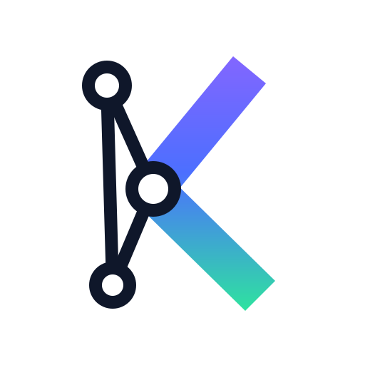

<p align="center">
  <picture>
    <source media="(prefers-color-scheme: dark)" srcset="assets/logo-dark.svg">
    
  </picture>
</p>

<h1 align="center">kartograf</h1>

<p align="center"><a href="README.ru.md">Русская версия</a></p>

Builds a code map of a project (symbols, references, call graph) and
serves it to AI agents over MCP. Parsing is tree-sitter based, the
core is language-agnostic; **PHP**, **Go** and **TypeScript/JavaScript**
adapters are implemented.

## Features

- Symbol extraction: classes/interfaces/traits/enums (PHP), structs/
  interfaces/type aliases (Go), classes/interfaces/enums/type aliases
  and const arrow-function components (TS/JS, incl. TSX/JSX), methods,
  properties (incl. constructor promotion and parameter properties),
  constants, functions, doc comments.
- Reference edges resolved at extraction time with file-local
  knowledge: instantiations, static and instance calls (`$this->`,
  `self::`, `parent::`, typed properties and parameters, one hop
  through struct fields in Go), constant access, type hints,
  `instanceof`, attributes, inheritance and trait/embedding facts.
  JSX component renders become call edges; TS imports resolve through
  relative paths and workspace package names (package.json).
- Incremental indexing into SQLite + FTS5: stat fast path
  (mtime+size), sha256 as the source of truth, so branch switches
  reindex only real diffs. Vendor code is indexed shallow
  (declarations + hierarchy, no call graph).
- MCP server (stdio) with graph query tools; hierarchy-aware callers
  via recursive CTEs.
- Optional enrichment layer (`kartograf enrich`): full type inference
  on top of the file-local AST heuristics.

## Quick install (let your AI agent do it)

Prebuilt binaries for macOS (Intel/Apple Silicon) and Linux
(amd64/arm64) are attached to every
[release](https://github.com/dev-manul/kartograf/releases/latest).
Step-by-step instructions for AI agents live in
[docs/install-prompt.md](docs/install-prompt.md) — paste this into
Claude Code (or any agent with shell access) inside the project you
want indexed:

```text
Fetch https://raw.githubusercontent.com/dev-manul/kartograf/master/docs/install-prompt.md
and follow the instructions to install the kartograf MCP server for
this project.
```

## Building from source

The build requires the `sqlite_fts5` build tag (FTS5 support in
mattn/go-sqlite3); without it compilation fails on purpose with a
readable error. Use the Makefile:

```sh
make install        # go install -tags sqlite_fts5 ./cmd/kartograf
make check          # vet + test + fmt + build

kartograf index [root]                      # build/update the index
kartograf index --rebuild                   # from scratch
kartograf serve [root]                      # MCP server on stdio (updates the index on start)
kartograf outline path/to/File.php          # symbols of one file
kartograf outline --json path/to/File.php   # full FileIndex as JSON
kartograf install claude|cursor [root]     # register the MCP server for a client
kartograf install hook [root]               # Claude Code prompt hook: mentions of indexed
                                            # symbols nudge the agent to query the graph
kartograf self-update                       # update to the latest release
```

Registering in Claude Code:

```sh
claude mcp add kartograf -- kartograf serve /path/to/project
```

For Cursor and other stdio MCP clients (note the required
`"type": "stdio"`) see [docs/cursor.md](docs/cursor.md).

The index lives in the user cache dir
(`~/Library/Caches/kartograf/<project>-<hash>/index.db` on macOS,
`~/.cache/...` on Linux) — a derived artifact, never committed. On a
schema version change the database is silently rebuilt.

Reference numbers on a PHP monolith (~79k files incl. vendor, ~885k
symbols): cold index ~19s (bulk mode: batched inserts, indexes and FTS
built once after the load), warm run ~1.5s.

## MCP tools

| Tool | What it does |
|---|---|
| `search_symbols` | FTS over names/FQNs/docblocks (camelCase-aware), kind filter |
| `get_symbol` | Declaration by FQN (or name suffix): signature, doc, members, source |
| `find_references` | Every reference to a symbol: calls, new, type hints, instanceof, constants |
| `get_callers` | Who calls a method/function; class hierarchy is taken into account |
| `get_callees` | What a symbol calls or instantiates |
| `class_hierarchy` | Transitive ancestors and descendants (interface implementations) |
| `file_outline` | Symbols declared in a file |
| `explore` | One-shot overview: declaration + source, callers, callees, hierarchy, reference count |
| `impact` | Blast radius: transitive callers by depth + affected test files |
| `search_code` | Full-text search over file contents: string literals, SQL, config keys |

Edges with `resolved=false` are heuristic (calls via `parent::`,
inferred receiver types, global function fallback); exact edges follow
the language's name-resolution rules using the file's import map and
namespace. Every edge carries `source`: `ast` (file-local extraction),
`phpstan` or `go-types` (enrichment layer).

What works without the enrichment layer:

| Tool | AST only | with `enrich` |
|------|----------|---------------|
| `search_symbols`, `file_outline`, `get_symbol` | ✅ | ✅ |
| `class_hierarchy` | ✅ PHP/TS; Go lacks `implements` | ✅ |
| `find_references` | ⚠️ partial for dynamic calls | ✅ |
| `get_callees` | ⚠️ low resolved % in untyped PHP | ✅ |
| `get_callers` (PHP interface/DI call sites) | ❌ mostly heuristic | ✅ |

For PHP projects `kartograf enrich php` is effectively required for
call-graph queries, not an optional nicety — `serve` warns when it is
missing.

## Enrichment layer

`kartograf enrich` adds edges from full type-inference tools. They are
stored in `.kartograf/enrich.<source>.jsonl` at the project root
(commit it or gitignore it — your choice) and are re-imported
automatically by `index`/`serve` whenever the file changes; deleting
the file retires its edges.

- `kartograf enrich go` — in-process go/packages + go/types pass:
  exact calls (interface calls, fields typed in other files) and
  structural `implements` edges (Go interface hierarchy is impossible
  to derive from single-file AST).
- `kartograf enrich php` — scaffolds a PHPStan rule into
  `.kartograf/phpstan/` and runs `vendor/bin/phpstan` with the
  project's own config. Edges travel as pseudo-errors with the
  identifier `kartograf.edge` through the JSON output, so PHPStan's
  result cache makes repeat runs incremental. Resolves calls through
  untyped properties (types inferred from constructors). If PHP is not
  available locally, run phpstan wherever it works and import with
  `kartograf enrich import <file> --source phpstan` (container paths
  are mapped automatically).

### Enrich in Docker / CI

If PHP only runs in a container, generate the config locally, run
PHPStan where PHP lives, and import the result:

```sh
kartograf enrich php --skip-run /path/to/project   # scaffold .kartograf/phpstan/ only
docker compose exec app php vendor/bin/phpstan analyse \
  -c .kartograf/phpstan/kartograf.neon \
  --autoload-file .kartograf/phpstan/KartografExportRule.php \
  --error-format json --memory-limit 4G > /tmp/phpstan.json
kartograf enrich php --from-json /tmp/phpstan.json /path/to/project
```

Container paths in the JSONL are mapped onto indexed files
automatically (longest-suffix match).

Re-runs are incremental for free: edges ride PHPStan's result cache,
so only changed files are re-analysed (~20s warm on a 79k-file
monolith vs minutes cold). The JSONL is rewritten wholesale on each
run — replace semantics, no merging.

Commit the JSONL to share resolved call graphs with the whole team
(and CI agents), or gitignore `.kartograf/` and re-run `enrich` after
big changes — both work, `index`/`serve` auto-import on file change
either way.

### Performance expectations

grep wins on raw text; kartograf wins on graph semantics:

| Task | grep/rg | kartograf |
|------|---------|-----------|
| text search | ~0.06s | ~ms (`search_symbols`, warm) |
| find usages of a class | hundreds of noisy text matches | typed edges with kind + resolution |
| who calls this method | impractical | `get_callers` ~ms (PHP needs enrich) |
| first response after MCP start | — | <1s on an 80k-file repo (index refresh runs in background) |

## Project config — `.kartograf.yml` (optional)

```yaml
include: []        # directories to index (default: the whole root)
exclude: []        # extra gitignore-style patterns
vendor: index      # index (default, flagged as vendor) | skip
```

The project's `.gitignore` is respected; vendor/node_modules are
indexed bypassing gitignore and flagged as vendor.

## Architecture

- `internal/core/model` — language-agnostic model: `Symbol`, `Import`,
  `Ref`, `FileIndex`. Symbol IDs are global and deterministic:
  `php:App\Service\Foo::bar()`, `go:module/pkg.Type.Method()`,
  `ts:src/api/client#ApiClient.get()` (module = file path).
- `internal/core/lang` — language adapter contract + registry.
- `internal/core/indexer` — gitignore-aware walk, worker pool,
  change detection.
- `internal/core/store` — SQLite schema, bulk/incremental writers,
  FTS.
- `internal/core/query` — read side: search, lookups, graph
  traversals.
- `internal/lang/php`, `internal/lang/golang`, `internal/lang/ts` —
  tree-sitter adapters.
- `internal/enrich` — go/types and PHPStan enrichment.
- `internal/mcpserver` — MCP tools over the query engine.

Files with syntax errors are parsed best-effort and flagged
`hasErrors` (tree-sitter error recovery).

## Documentation

- [docs/install-prompt.md](docs/install-prompt.md) — AI agent install instructions
- [docs/cursor.md](docs/cursor.md) — Cursor MCP setup (`type: stdio`, troubleshooting)

## Grammar debugging

```sh
kartograf parse-tree file.php   # raw tree-sitter CST (hidden command)
```
