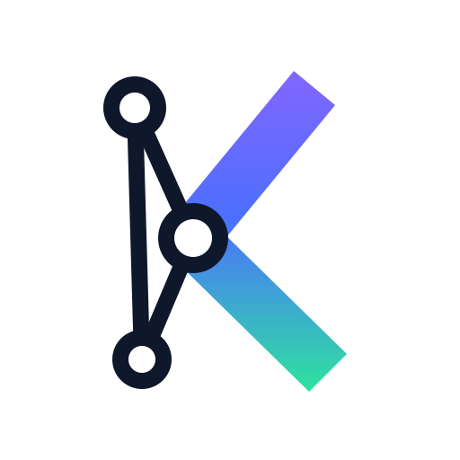

<p align="center">
  <picture>
    <source media="(prefers-color-scheme: dark)" srcset="assets/logo-dark.svg">
    
  </picture>
</p>

<h1 align="center">kartograf</h1>

<p align="center"><a href="README.md">English version</a></p>

Строит карту кода проекта (символы, ссылки, граф вызовов) и отдаёт её
AI-агентам через MCP. Парсинг — tree-sitter, ядро языконезависимое;
реализованы адаптеры **PHP**, **Go** и **TypeScript/JavaScript**.

## Возможности

- Извлечение символов: классы/интерфейсы/трейты/енумы (PHP),
  структуры/интерфейсы/type alias (Go), классы/интерфейсы/енумы/type
  alias и const-стрелочные компоненты (TS/JS, включая TSX/JSX), методы,
  свойства (включая промоутнутые и parameter properties), константы,
  функции, докблоки.
- Рёбра ссылок с резолвом на этапе извлечения по file-local знанию:
  инстанцирования, статические и инстансные вызовы (`$this->`,
  `self::`, `parent::`, типизированные свойства и параметры, one-hop
  через поля структур в Go), доступ к константам, type hints,
  `instanceof`, атрибуты, наследование и трейты/embedding. Рендер
  JSX-компонента — ребро вызова; импорты TS резолвятся по
  относительным путям и именам workspace-пакетов (package.json).
- Инкрементальный индекс в SQLite + FTS5: stat-фастпас (mtime+size),
  sha256 как источник истины — переключение веток реиндексирует только
  реальный дифф. Vendor индексируется неглубоко (декларации +
  иерархия, без графа вызовов).
- MCP-сервер (stdio) с графовыми тулзами; callers с учётом иерархии
  классов через рекурсивные CTE.
- Опциональный слой точности (`kartograf enrich`): полный
  тайп-инференс поверх file-local AST-эвристик.
- Рабочая заметка-передача на git-ветку (`get_task_context` /
  `put_task_context`): что сделано, ключевые файлы, решения и что
  осталось. Лежит в общем git-каталоге. Агент пишет её, когда
  работа останавливается, чтобы новый чат через несколько дней
  подхватил задачу. До 4 КиБ.

## Быстрая установка (руками AI-агента)

Готовые бинари под macOS (Intel/Apple Silicon) и Linux (amd64/arm64)
прикреплены к каждому
[релизу](https://github.com/dev-manul/kartograf/releases/latest).
Пошаговые инструкции для AI-агентов лежат в
[docs/install-prompt.md](docs/install-prompt.md) — вставьте в Claude
Code (или любого агента с доступом к шеллу) внутри проекта, который
хотите проиндексировать:

```text
Fetch https://raw.githubusercontent.com/dev-manul/kartograf/master/docs/install-prompt.md
and follow the instructions to install the kartograf MCP server for
this project.
```

## Сборка из исходников

Сборка требует build-тег `sqlite_fts5` (FTS5 в mattn/go-sqlite3);
без тега компиляция намеренно падает с понятной ошибкой. Проще через
Makefile:

```sh
make install        # go install -tags sqlite_fts5 ./cmd/kartograf
make check          # vet + test + fmt + build

kartograf index [root]                      # построить/обновить индекс
kartograf index --rebuild                   # с нуля
kartograf serve [root]                      # MCP-сервер на stdio (сам доиндексирует на старте)
kartograf outline path/to/File.php          # символы файла
kartograf outline --json path/to/File.php   # полный FileIndex в JSON
kartograf install claude|cursor [root]     # зарегистрировать MCP-сервер у клиента
kartograf install codex [root]              # хуки Codex: UserPromptSubmit и Stop
kartograf install hook [root]               # хук Claude Code: упоминание символа в промпте
                                            # подсказывает агенту сходить в граф
kartograf self-update                       # обновиться до последнего релиза
```

В каждом релизе на GitHub — коммиты с прошлого тега, по одной
английской строке на коммит.

Регистрация в Claude Code:

```sh
claude mcp add kartograf -- kartograf serve /path/to/project
```

Для Cursor и других stdio MCP-клиентов (обязателен `"type": "stdio"`)
см. [docs/cursor.md](docs/cursor.md).

Индекс лежит в кэше пользователя
(`~/Library/Caches/kartograf/<проект>-<hash>/index.db` на macOS,
`~/.cache/...` на Linux) — производный артефакт, в гит не коммитится.
При смене версии схемы база молча пересобирается.

Ориентиры на PHP-монолите (~79k файлов с vendor, ~885k символов):
холодный индекс ~19 с (bulk-режим: батчевые вставки, индексы и FTS
строятся один раз после заливки), тёплый прогон ~1.5 с.

## MCP-тулзы

| Тулза | Что делает |
|---|---|
| `search_symbols` | FTS по именам/FQN/докблокам (понимает camelCase), фильтры по kind и префиксу пути |
| `get_symbol` | Декларация по FQN (или хвосту имени): сигнатура, док, члены, исходник |
| `find_references` | Все ссылки на символ: вызовы, new, type hints, instanceof, константы |
| `get_callers` | Кто вызывает метод/функцию; учитывается иерархия классов |
| `get_callees` | Что вызывает/инстанцирует символ |
| `class_hierarchy` | Транзитивные предки и потомки (реализации интерфейса) |
| `file_outline` | Символы файла |
| `explore` | Обзор одним вызовом: декларация + сорс, callers, callees, иерархия, счётчик ссылок |
| `impact` | Радиус поражения: транзитивные callers по уровням + задетые тесты |
| `search_code` | Полнотекстовый поиск по содержимому файлов: литералы, SQL, конфиг-ключи |
| `get_task_context` | Заметка-передача по ветке (не вызывать, если `<kartograf_task>` этой ветки уже есть в чате) |
| `put_task_context` | Пишет передачу, когда работа останавливается, чтобы поздний чат мог её продолжить (4 КиБ; пустое тело удаляет) |
| `list_task_contexts` | Другие ветки, у которых есть передача |
| `find_task` | Ветки, в имени которых есть номер задачи, включая вложенные репозитории |
| `branch_changes` | Файлы и символы, которые ветка изменила относительно основной, если передачи нет |

Рёбра с `resolved=false` — эвристика (вызов через `parent::`,
выведенный тип получателя, глобальный фолбэк функций); точные рёбра
резолвятся по правилам языка из карты импортов и неймспейса файла.
TypeScript `export { Name } from` и `export * from` проходятся на
несколько шагов, так что вызов через реэкспорт в `index.ts`
стыкуется с файлом, где имя объявлено. На каждом ребре есть
`source`: `ast` (file-local извлечение), `phpstan` или `go-types`
(слой точности).

Что работает без слоя точности:

| Тулза | Только AST | с `enrich` |
|------|----------|---------------|
| `search_symbols`, `file_outline`, `get_symbol` | ✅ | ✅ |
| `class_hierarchy` | ✅ PHP/TS; в Go нет `implements` | ✅ |
| `find_references` | ⚠️ частично для динамики | ✅ |
| `get_callees` | ⚠️ мало resolved в нетипизированном PHP | ✅ |
| `get_callers` (PHP интерфейсы/DI) | ❌ почти всё эвристика | ✅ |

Для PHP-проектов `kartograf enrich php` — фактически обязателен для
графа вызовов, а не опциональная фича: `serve` предупреждает, если
его нет, а `get_callers`, `get_callees`, `find_references` и
`explore` пишут об этом в `notice`, а не возвращают тихий пустой
список.

## Контекст задачи

Заметка-передача на git-ветку позволяет новому чату продолжить работу
спустя дни: какая была задача, что изменилось (ключевые файлы и
символы), какие решения приняты и почему, что осталось и как
проверить. Агент пишет её, когда работа останавливается, а не на
каждом ходе. Одна заметка — не больше 4 КиБ. Пути из заметки, по
которым коммит новее самой заметки, возвращаются как `staleFiles`:
новый чат видит, что код уже уехал.

Заметки лежат в общем git-каталоге репозитория
(`<git-common-dir>/kartograf/context/`), вне рабочего дерева и вне
базы индекса, так что `git checkout` и `index --rebuild` их не
трогают. Заметки локальны для клона; связанные worktree одного
репозитория видят одни и те же.

`get_task_context` вызывайте, только если блока `<kartograf_task>`
этой ветки ещё нет в разговоре. Доработки часто приходят на новой
ветке: `list_task_contexts` и список `<kartograf_tasks>`, который хук
Claude Code добавляет в первый промпт сессии, называют старые
заметки. Если назван номер задачи, а не ветка, `find_task` находит
ветку; вложенный репозиторий возвращается как `repo` и передаётся в
остальные инструменты. В каждом репозитории можно задать
`task.branch` в `.kartograf.yml` (см. ниже); иначе достаточно, чтобы
имя ветки содержало номер. Отсоединённый HEAD записывается как
`HEAD@<sha>`. Хук
Claude Code и, после `kartograf install cursor`, хук
beforeSubmitPrompt в Cursor вставляют заметку текущей ветки один раз
за сессию и больше не повторяют. Если в том же чате переключиться
на другую ветку, её заметка показывается один раз. Хук Stop в Claude Code и тот же хук после `kartograf install codex`
один раз в конце хода просит дописать заметку, если ветка уехала, а
заметки нет или она устарела. В Codex хук нужно доверить через
`/hooks`, и должна быть включена `features.hooks`.

## Слой точности

`kartograf enrich` добавляет рёбра от инструментов полного
тайп-инференса. Они хранятся в `.kartograf/enrich.<source>.jsonl` в
корне проекта (коммитить или игнорировать — на ваше усмотрение) и
автоматически реимпортируются `index`/`serve` при изменении файла;
удаление файла убирает его рёбра.

Корнем индекса может быть целый workspace из многих репозиториев
(`kartograf serve ~/projects`): вложенные
`<repo>/.kartograf/enrich.*.jsonl` тоже находятся и импортируются, а
пути из отчётов инструментов резолвятся относительно репозитория —
владельца файла, так что два Go-сервиса с одинаковым
`internal/config/config.go` не перепутаются. `enrich` запускается
внутри каждого репозитория как обычно; workspace-индекс подхватит файлы
при следующем обновлении. В workspace первый сегмент пути в каждом
результате — директория репозитория, а `pathPrefix` (у
`search_symbols`, `search_code` и графовых тулз) сужает запрос до
одного репозитория.

- `kartograf enrich go` — go/packages + go/types в процессе: точные
  вызовы (интерфейсные, через поля из других файлов) и структурные
  `implements`-рёбра (иерархию интерфейсов Go из file-local AST не
  получить в принципе).
- `kartograf enrich php` — генерирует правило PHPStan в
  `.kartograf/phpstan/` и запускает `vendor/bin/phpstan` с конфигом
  проекта. Рёбра едут как псевдо-ошибки с identifier `kartograf.edge`
  через JSON-вывод — result cache PHPStan делает повторные прогоны
  инкрементальными. Разрешает вызовы через нетипизированные свойства
  (тип выводится из конструктора). Если php нет локально — запустите
  phpstan где угодно и импортируйте: `kartograf enrich import <file>
  --source phpstan` (контейнерные пути маппятся автоматически).

### Enrich в Docker / CI

Если PHP живёт только в контейнере: сгенерируйте конфиг локально,
запустите PHPStan там, где есть PHP, и импортируйте результат:

```sh
kartograf enrich php --skip-run /path/to/project   # только scaffold .kartograf/phpstan/
docker compose exec app php vendor/bin/phpstan analyse \
  -c .kartograf/phpstan/kartograf.neon \
  --autoload-file .kartograf/phpstan/KartografExportRule.php \
  --error-format json --memory-limit 4G > /tmp/phpstan.json
kartograf enrich php --from-json /tmp/phpstan.json /path/to/project
```

Контейнерные пути в JSONL маппятся на индексированные файлы
автоматически (по самому длинному суффиксу).

Повторные прогоны инкрементальны бесплатно: рёбра едут через result
cache PHPStan, поэтому переанализируются только изменённые файлы
(~20 с на тёплом кэше 79k-файлового монолита против минут с нуля).
JSONL перезаписывается целиком — семантика replace, без слияния.

Коммитьте JSONL, чтобы шарить разрезолвленный граф вызовов с командой
(и CI-агентами), либо добавьте `.kartograf/` в `.gitignore` и
перегоняйте `enrich` после больших изменений — работает и так и так,
`index`/`serve` реимпортируют файл при изменении.

### Ожидания по скорости

grep выигрывает на сыром тексте; kartograf — на семантике графа:

| Задача | grep/rg | kartograf |
|--------|---------|-----------|
| поиск текста | ~0.06s | ~мс (`search_symbols`, тёплый) |
| использования класса | сотни шумных текстовых совпадений | типизированные рёбра с kind и резолвом |
| кто вызывает метод | нереально | `get_callers` ~мс (PHP требует enrich) |
| первый ответ после старта MCP | — | <1 с на 80k-файловой репе (рефреш индекса в фоне) |

## Конфиг проекта — `.kartograf.yml` (опционально)

```yaml
include: []        # директории для индексации (по умолчанию весь корень)
exclude: []        # доп. gitignore-паттерны
vendor: index      # index (по умолчанию, с пометкой vendor) | skip
task:
  branch: "feature/{id}-"   # необязательно; как номер задачи сидит в имени ветки.
                             # пусто = имя ветки содержит номер
```

`.gitignore` проекта уважается; vendor/node_modules индексируются в
обход gitignore и помечаются флагом vendor.

## Архитектура

- `internal/core/model` — языконезависимая модель: `Symbol`, `Import`,
  `Ref`, `FileIndex`. ID символа глобален и детерминирован:
  `php:App\Service\Foo::bar()`, `go:module/pkg.Type.Method()`,
  `ts:src/api/client#ApiClient.get()` (модуль = путь файла).
- `internal/core/lang` — контракт языкового адаптера + реестр.
- `internal/core/indexer` — gitignore-aware обход, воркер-пул,
  детект изменений.
- `internal/core/store` — схема SQLite, bulk/инкрементальный writer,
  FTS.
- `internal/core/query` — чтение: поиск, lookups, обходы графа.
- `internal/lang/php`, `internal/lang/golang`, `internal/lang/ts` —
  tree-sitter адаптеры.
- `internal/enrich` — обогащение go/types и PHPStan.
- `internal/mcpserver` — MCP-тулзы поверх query-движка.
- `internal/taskctx` — рабочие заметки по веткам, вне индекса.

Файлы с синтаксическими ошибками парсятся best-effort и помечаются
`hasErrors` (error-recovery у tree-sitter).

## Документация

- [docs/install-prompt.md](docs/install-prompt.md) — инструкции установки для AI-агентов
- [docs/cursor.md](docs/cursor.md) — MCP в Cursor (`type: stdio`, troubleshooting)

## Отладка грамматик

```sh
kartograf parse-tree file.php   # сырой CST tree-sitter (скрытая команда)
```
